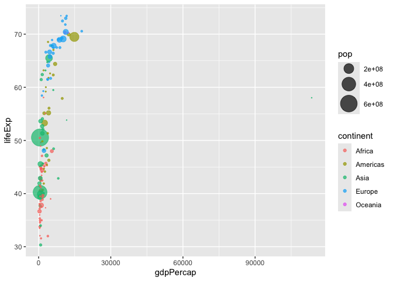

# Class 5: Data VIz with ggplot
Yujia Liu

## Plotting in R

R has lot’s of ways to make plots and figures. This includes so-called
**base** graphics and packages like **ggplot**

``` r
plot(cars)
```


This is a **base** R plaot of the in-built ‘cars’ dataset that has only
two column

``` r
head(cars)
```

      speed dist
    1     4    2
    2     4   10
    3     7    4
    4     7   22
    5     8   16
    6     9   10

> Q. How would we plot this wee dataset with **ggplot2**

All ggplot figures have at least 3 layers

**data** **aesthetics** (how the data map to the plot) **geoms** (how we
draw the plot, lines, points, etc.)

Before I use any new package I need to download and install it with the
‘install.packages()’ command.

I never use `install.packages()` within my quarto document otherwise I
will install the package over and over and over again - which is silly!

Once a package is installed i can load it up with the `library()`
function.

``` r
#install.packages("ggplots")
library(ggplot2)
ggplot(cars)+ 
  aes(x=speed,y=dist)+
  geom_point()
```


**Key point**: For simple fplots (like the one above) ggplot is more
verbose (we need to do more typing) bus as plots get more complicated
ggplot starts to be more clear and simple than base R plot()

\#shortcut(option commamd i)

``` r
ggplot(cars)+
  aes(speed,dist)+
  geom_point()+
  geom_smooth(method=lm, se = FALSE)+
  labs(title="Stopping distance of old cars",
       x="Speed (MPH)", 
       y="Stopping Distance (ft)",
       subtitle = "From the in-built cars dataset",
       caption="Dataset: 'cars'")+
  theme_bw()
```

    `geom_smooth()` using formula = 'y ~ x'


> Q. Which plot types are typically NOT used to compare distributions of
> numeric variables?

Network graphs

> Q. Which statement about data visualization with ggplot2 is incorrect?

ggplot2 is the only way to create plots in R

## Scatterplot

Results of a differential expression analysis where a new anti-viral
drug is being tested

``` r
url <- "https://bioboot.github.io/bimm143_S20/class-material/up_down_expression.txt"
genes <- read.delim(url)
head(genes)
```

            Gene Condition1 Condition2      State
    1      A4GNT -3.6808610 -3.4401355 unchanging
    2       AAAS  4.5479580  4.3864126 unchanging
    3      AASDH  3.7190695  3.4787276 unchanging
    4       AATF  5.0784720  5.0151916 unchanging
    5       AATK  0.4711421  0.5598642 unchanging
    6 AB015752.4 -3.6808610 -3.5921390 unchanging

> Q. Use the nrow() function to find out how many genes are in this
> dataset. What is your answer?

``` r
nrow(genes)
```

    [1] 5196

> Q. Use the colnames() function and the ncol() function on the genes
> data frame to find out what the column names are (we will need these
> later) and how many columns there are. How many columns did you find?

``` r
colnames(genes)
```

    [1] "Gene"       "Condition1" "Condition2" "State"     

``` r
ncol(genes)
```

    [1] 4

> Q. Use the table() function on the State column of this data.frame to
> find out how many ‘up’ regulated genes there are. What is your answer?

``` r
table(genes$State)
```


          down unchanging         up 
            72       4997        127 

> Q. Using your values above and 2 significant figures. What fraction of
> total genes is up-regulated in this dataset?

``` r
round( table(genes$State)/nrow(genes) * 100, 2 )
```


          down unchanging         up 
          1.39      96.17       2.44 

A first plot:

``` r
ggplot(genes) + 
    aes(x=Condition1, y=Condition2) +
    geom_point()
```


``` r
p<-ggplot(genes)+
  aes(x=Condition1, y=Condition2, col=State)+
  geom_point()

p
```


``` r
p + 
  scale_colour_manual( values=c("blue","gray","red") )+
  labs(title="Change in Gene Expression in Drug Test",
       x="Control (no drug) ",
         y="Drug Treatment")
```


## Going Further

The gapminder dataset contains economic and demographic data about
various countries since 1952. The data itself is available as either a
tab-delimited file online, or via the `gapmider` package.

``` r
# File location online
url <- "https://raw.githubusercontent.com/jennybc/gapminder/master/inst/extdata/gapminder.tsv"

gapminder <- read.delim(url)


library(dplyr)
```


    Attaching package: 'dplyr'

    The following objects are masked from 'package:stats':

        filter, lag

    The following objects are masked from 'package:base':

        intersect, setdiff, setequal, union

``` r
gapminder_2007 <- gapminder %>% filter(year==2007)
```

Let’s consider the gapminder_2007 dataset which contains the variables
GDP per capita gdpPercap and life expectancy lifeExp for 142 countries
in the year 2007

``` r
ggplot(gapminder_2007) +
  aes(x=gdpPercap,
      y=lifeExp,
      color=continent,
      size=pop) +
  geom_point(alpha=0.5) #alpha=changes point transparancy
```


**Adjust Point Size**

``` r
p2007<- ggplot(gapminder_2007) + 
  aes(x = gdpPercap, 
      y = lifeExp, 
      size = pop) + #set the point size based on the population (size=pop) of each country
  geom_point(alpha=0.5)+
  scale_size_area(max_size = 10) #reflect the population differences by the point size 

p2007
```


**Plot for 1957**

``` r
gapminder_1957 <- gapminder %>% filter(year==1957)

p1957<- ggplot(gapminder_1957) + 
  aes(x = gdpPercap, 
      y = lifeExp, 
      color=continent,
      size = pop) +
  geom_point(alpha=0.7) + 
  scale_size_area(max_size = 10) 

p1957
```



**1957 and 2007**

``` r
gapminder_1957 <- gapminder %>% filter(year==1957 | year==2007)

ggplot(gapminder_1957) + 
  geom_point(aes(x = gdpPercap, y = lifeExp, color=continent,
                 size = pop), alpha=0.7) + 
  scale_size_area(max_size = 10) +
  facet_wrap(~year)
```


> Q. Extract data fro the US in 1992

``` r
filter(gapminder,country=="United States",
       year==1992)
```

            country continent year lifeExp       pop gdpPercap
    1 United States  Americas 1992   76.09 256894189  32003.93

> Q. What is the population of Ireland in 2007

``` r
filter(gapminder, country=="Ireland",year==2007)
```

      country continent year lifeExp     pop gdpPercap
    1 Ireland    Europe 2007  78.885 4109086     40676

> Q. What countries in data set had pop smaller than Ireland in 2007?

- 1.  First limit/subset the data set to the year 2007
- 2.  Then find the `pop` value for Ireland
- 3.  Then extract all rows with `pop` less than Ireland’s

``` r
Ireland2007<- filter(gapminder,year==2007,country=="Ireland") #Step 1

Ireland2007$pop #Step 2
```

    [1] 4109086

``` r
nrow(filter(gapminder,year==2007,pop<Ireland2007$pop)) #Step 3
```

    [1] 31

\##Box Charts

Below you can find an example showing the number of people (in millions)
in the five biggest countries by population in 2007

``` r
gapminder_top5 <- gapminder %>% 
  filter(year==2007) %>% 
  arrange(desc(pop)) %>% 
  top_n(5, pop)

gapminder_top5
```

            country continent year lifeExp        pop gdpPercap
    1         China      Asia 2007  72.961 1318683096  4959.115
    2         India      Asia 2007  64.698 1110396331  2452.210
    3 United States  Americas 2007  78.242  301139947 42951.653
    4     Indonesia      Asia 2007  70.650  223547000  3540.652
    5        Brazil  Americas 2007  72.390  190010647  9065.801

The `echo: false` option disables the printing of code (only output is
displayed).
