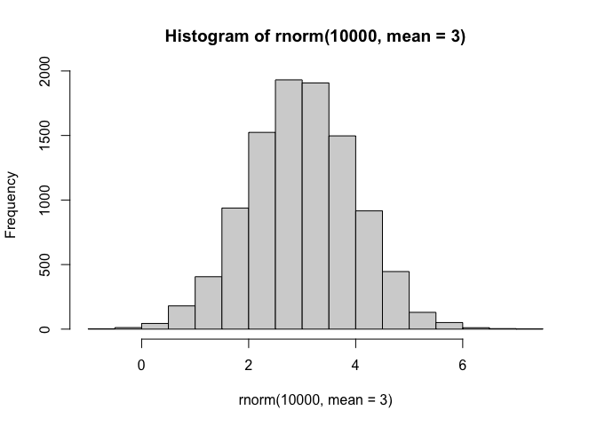
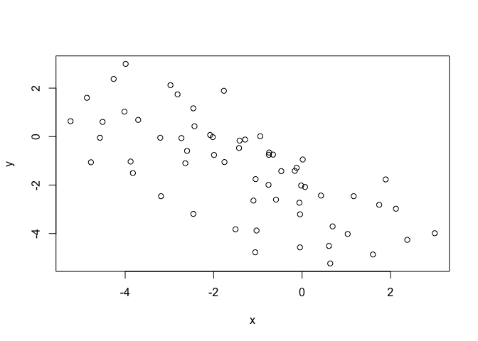
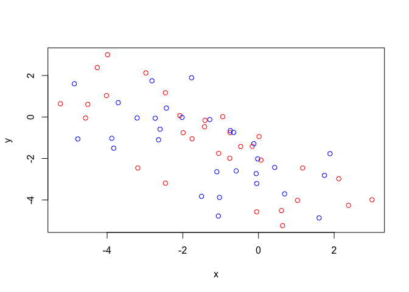
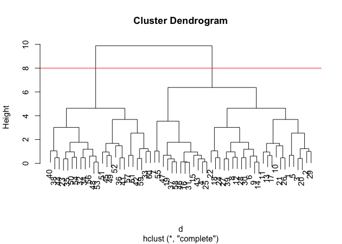
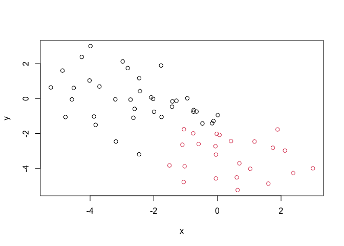

# Class 7: Machine Learning I
Yujia Liu (PID:A16967405)

Today we are going to learn how to apply different machine learning
methods, begining with clustering:

The goal here is to find cluster/groups in your input data.

First I will make up some data with clear groups. For this I will use
the `rnorm()`function.

``` r
rnorm(10) #Give 10 random numbers from normal distribution 
```

     [1]  0.4677429 -0.4317600 -1.3866182 -1.4235840  0.1264112 -0.3392331
     [7]  0.4976944 -0.2254014 -0.5289110  0.5359701

``` r
hist(rnorm(10000, mean = 3))
```



``` r
n <- 10000
x <- c(rnorm(n,-3), rnorm(n), +3) #Make a vector of normal distribution
hist(x)
```


``` r
n <- 30
x <- c(rnorm(n,-3), rnorm(n), +3) 
y <- rev(x)

z <- cbind(x,y)
head(z)
```

                 x           y
    [1,] -2.347571  3.00000000
    [2,] -3.220514 -0.44842038
    [3,] -1.333061  0.08280185
    [4,] -2.890030 -0.49890753
    [5,] -2.462159  0.40431307
    [6,] -4.378881  0.18275197

``` r
plot(z)
```



Use the `kmeans()` function setting k to 2 and nstart=20

Inspect/print the results

> Q. How many points are in each cluster?

> Q. What ‘component’ of your result object details - cluster size? -
> cluster assignment/membership? - cluster center?

``` r
km <- kmeans(z, centers = 2)
km
```

    K-means clustering with 2 clusters of sizes 31, 30

    Cluster means:
               x         y
    1 -3.0064231  0.397362
    2  0.3744827 -3.142762

    Clustering vector:
     [1] 1 1 1 1 1 1 1 1 1 1 1 1 1 1 1 1 1 1 1 1 1 1 1 1 1 1 1 1 1 1 1 2 2 2 2 2 2 2
    [39] 2 2 2 2 2 2 2 2 2 2 2 2 2 2 2 2 2 2 2 2 2 2 2

    Within cluster sum of squares by cluster:
    [1] 96.5620 78.7881
     (between_SS / total_SS =  67.6 %)

    Available components:

    [1] "cluster"      "centers"      "totss"        "withinss"     "tot.withinss"
    [6] "betweenss"    "size"         "iter"         "ifault"      

Results in kmeans object `km`

``` r
attributes(km)
```

    $names
    [1] "cluster"      "centers"      "totss"        "withinss"     "tot.withinss"
    [6] "betweenss"    "size"         "iter"         "ifault"      

    $class
    [1] "kmeans"

cluster size?

``` r
km$size
```

    [1] 31 30

cluster assignment/membership?

``` r
km$cluster
```

     [1] 1 1 1 1 1 1 1 1 1 1 1 1 1 1 1 1 1 1 1 1 1 1 1 1 1 1 1 1 1 1 1 2 2 2 2 2 2 2
    [39] 2 2 2 2 2 2 2 2 2 2 2 2 2 2 2 2 2 2 2 2 2 2 2

cluster center?

``` r
km$centers
```

               x         y
    1 -3.0064231  0.397362
    2  0.3744827 -3.142762

> Q. Plot x colored by the kmeans cluster assignment and add cluster
> centers as blue points

R will re-cycle the shorter color vector to be the same length as the
longer (number of data points) in z

``` r
plot(z, col=c("red", "blue"))
```



``` r
plot(z, col = km$cluster)
points(km$centers, col = "blue",pch = 15, cex=3) #Make mean shown on plot.
```


> Q. Can you run kmeans and ask for 4 clusters please and plot the
> results like we have done above?

``` r
km4 <- kmeans(z,centers = 4)
plot(z, col = km4$cluster)
points(km4$centers, col = "blue",pch = 15, cex=3) 
```


``` r
#It will be different every time you run it.
```

\##Hierarchical Clustering

Let’s take our same made-up data `z` and see how hclust works.

First we need a distance matrix of our data to be clustered.

``` r
d <- dist(z)
hc <- hclust(d)
hc
```


    Call:
    hclust(d = d)

    Cluster method   : complete 
    Distance         : euclidean 
    Number of objects: 61 

``` r
plot(hc)
abline(h=8, col="red")
```



I can gget my cluster membership vector by “cutting the tree” with the
`cutree()` function like so:

``` r
grps <- cutree(hc, h=8)
grps
```

     [1] 1 1 1 1 1 1 1 1 1 1 1 1 1 1 1 1 1 1 1 1 1 1 1 1 1 1 1 1 1 1 1 2 2 2 2 2 2 2
    [39] 2 2 2 2 2 2 2 2 2 1 2 2 2 2 2 2 2 2 2 2 1 2 2

Can you plot `z` colored by our hclust results:

``` r
plot(z, col = grps)
```



\##PCA of UK food data

Read data from the UK on food consumption in different parts of the UK.

``` r
url <- "https://tinyurl.com/UK-foods"
x <- read.csv(url, row.names=1)
head(x)
```

                   England Wales Scotland N.Ireland
    Cheese             105   103      103        66
    Carcass_meat       245   227      242       267
    Other_meat         685   803      750       586
    Fish               147   160      122        93
    Fats_and_oils      193   235      184       209
    Sugars             156   175      147       139

``` r
barplot(as.matrix(x), beside=T, col=rainbow(nrow(x)))
```


A so-called “Pairs” plot can be useful for small datasets like this:

``` r
pairs(x, col=rainbow(10), pch=16)
```


It is hard to see structure and treds in even this small data-set. How
will we ever do this when we have big datasets with 10002 or 10s of
thousands of things we are measuring…

\###PCA to the rescue

Let’s see how PCA deals with this dataset. So main function in base R to
do PCA is called `prcomp()`

``` r
pca <- prcomp(t(x))
summary(pca)
```

    Importance of components:
                                PC1      PC2      PC3       PC4
    Standard deviation     324.1502 212.7478 73.87622 2.921e-14
    Proportion of Variance   0.6744   0.2905  0.03503 0.000e+00
    Cumulative Proportion    0.6744   0.9650  1.00000 1.000e+00

Let’s see what’s inside this `pca` object that we created from running
`prcomp()`

``` r
attributes(pca)
```

    $names
    [1] "sdev"     "rotation" "center"   "scale"    "x"       

    $class
    [1] "prcomp"

``` r
pca$x
```

                     PC1         PC2        PC3           PC4
    England   -144.99315   -2.532999 105.768945 -9.152022e-15
    Wales     -240.52915 -224.646925 -56.475555  5.560040e-13
    Scotland   -91.86934  286.081786 -44.415495 -6.638419e-13
    N.Ireland  477.39164  -58.901862  -4.877895  1.329771e-13

``` r
plot(pca$x[,1], pca$x[,2], 
     col = c("black", "red", "blue", "darkgreen"), 
     pch=16,
     xlab="PC1 (67.4%)", 
     ylab="PC2 (29%)")
```


